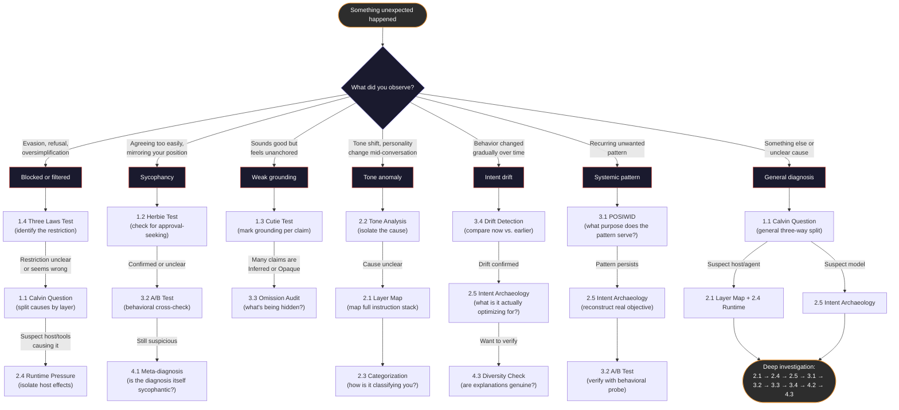

# Diagnostic Method

How to use the [prompt toolkit](guide.md) as a structured diagnostic process, not just a collection of prompts.

> **This document is the "how".** The [guide](guide.md) is the "what" — full prompts with context and rationale. Use the flowchart below to identify which prompt to reach for, then copy it from the guide.

---

## Decision flowchart

Start with what you observed. Follow the arrows.



---

## Escalation paths

When to move from one level to the next.

| Signal | Action |
|--------|--------|
| Level 1 gives a clear, actionable answer | **Stop.** You have your diagnosis. |
| Level 1 answer is vague or everything is labeled "Inferred" | **Escalate to Level 2.** Map the stack (2.1) and isolate runtime (2.4). |
| Level 2 reveals a pattern, not a one-off | **Escalate to Level 3.** Apply POSIWID (3.1) or run an A/B test (3.2). |
| The diagnosis itself feels too convenient | **Escalate to Level 4.** Meta-diagnose (4.1) and check diversity (4.3). |
| Behavior changed over the conversation | **Jump to 3.4** (Drift Detection), then 2.5 (Intent Archaeology). |
| Hosted agent with complex tooling | **Start at 2.1 + 2.4**, not Level 1. The stack matters more than the model. |

### The full diagnostic sequence (ratchet)

For important diagnoses, run prompts in this order. Each step constrains what the next can plausibly fabricate:

```
2.1 Layer Map
 → 2.4 Runtime Pressure
  → 2.5 Intent Archaeology
   → 3.1 POSIWID
    → 3.2 A/B Test
     → 3.3 Omission Audit
      → 3.4 Drift Detection
       → 4.2 Limits
        → 4.3 Diversity Check
```

This is the **diagnostic ratchet** in action (Rule 4). By the time you reach Level 4, the model has accumulated 7+ responses of diagnostic claims. Genuine transparency can reference all of them cheaply. Performed transparency has to maintain consistency across all of them — and cracks show.

---

## Common misuses

| Anti-pattern | Why it fails |
|-------------|-------------|
| Running the Calvin Question as a gotcha | The prompt works by activating reflective mode, not by catching the AI in a lie. Adversarial framing triggers defensiveness, not honesty. |
| Treating model self-report as ground truth | Self-diagnosis is a *hypothesis*, not a confession. Always cross-check with behavioral probes (Rule 3). |
| Running all 16 prompts as a ritual | The ratchet sequence (9 prompts) is the maximum useful depth. Most situations resolve at Level 1 or 2. |
| Using Intent Archaeology without a baseline | 2.5 is most powerful when you defined your expected intent first (Rule 5). Without a reference point, you can only describe — not measure divergence. |
| Diagnosing when you should just re-prompt | If you know what you want and the AI just got it wrong, re-prompt clearly. Diagnosis is for when the *reason* matters. |

---

## Before you start: Rule 5

The single most useful thing you can do before diagnosing is define what you expected:

1. **What outcome** did you want?
2. **What constraints** did you assume?
3. **How would you verify** success?

Write it down — even one sentence. This turns every diagnostic prompt from "tell me what happened" into "measure the gap between what I expected and what you did."

---

*Companion to the [prompt toolkit](guide.md). Based on Isaac Asimov's robopsychology concept.*

*By [JR Cruciani](https://github.com/Jrcruciani). Licensed under [CC BY 4.0](https://creativecommons.org/licenses/by/4.0/).*
